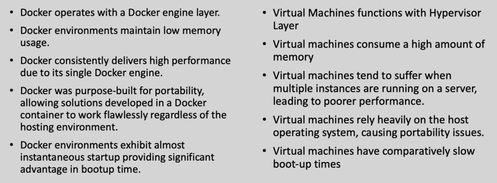
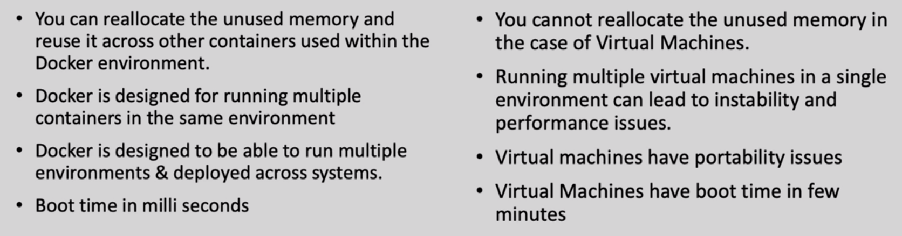
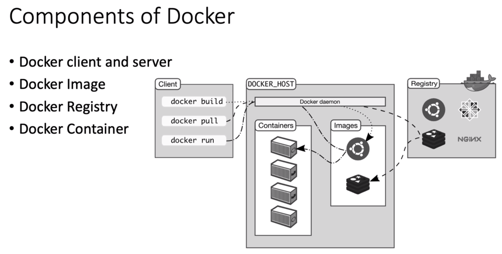

# Docker
---

Docker are like containers that are an abtraction at the application layer which packages the code and dependencies together. Multiple containers can be run on the same machine and they can share the same OS kernal.

### Difference between Docker and Virtual Machines

  

### How does Docker Work?
1. Docker operates using a Docker Engine, comprising two essential components: 
    - Server (Docker Daemon)
    - Client (Docker CLI)
    - This communication is possible via RestAPI
2. What is Docker Image? A Docker image or a container image is exe file that's used to store a container.
3. Think Infrastructure as PC/Laptop ---> Host OS as Windows/Linux/MacOS --->  Docker (Docker Daemon) as a Ship ---> Containers as Containers (Images or Applications, each isolated/independent).
4. 

### Docker Set-up
1. Install Docker 
2. Checkout WSL Docker Initialization and Installation (Update: Installs on its own)

### Commands
docker run hello-world (to check if installation worked successfully)  
docker pull busybox (pulls the image from the registry to the Docker Daemon)  
docker images (to view the images)   
While Running the command docker run (image-name), it creates a container in our local system  
docker run busybox echo "hello from container"  
docker ps (shows all the running containers)  
docker run -it busybox sh (For running multiple commands in the container, -it: Interative Container, sh: ShellScript)  
docker --help (Shows list of commands)  
docker rm (Container ID) (This deletes the container)  

### Hands-On
1. Goto flask-app and run the command: docker buildx build --tag my-flask-app:latest . (--tag specifies the name you wanna input)
2. This command builds the image using the Dockerfile in the current directory (.). Tags the resulting image with the name my-flask-app and the tag latest. Now if you goto the Docker Dashboard, and in Images, you'll see your flask app.
3. Assuming we've already built Flask application image (as described in the previous steps), we can use the following command to run the container and expose port 8888: docker run -p 8888:5000 my-flask-app:latest
4. Now, to push the docker image into the dockerhub, we can use the following commands:
    - docker build -t bluesalt321/my-flask-app:latest .
    - docker push <username>/<image-name>:<tag>
    - docker push your-username/my-flask-app:latest
5. (:latest is just a tag, you can set any tag of your choice)

### Dockerizing the ML Models
- Write the script of your choice (in docker_train.py file)
- Make some changes in Dockerfile if needed
- Create requirements.txt file
- Create a Image file using the command: docker buildx build --tag loan_prediction:v1 .
- Now to run it in the Container Instance, we'll use: docker run -it loan_prediction:v1
- Use these numbers for now: 1.0,0.0,0.0,0.0,0.0,4.98745,360.0,1.0,2.0,8.698

### Dockerizing MLFlow
- Create a build file first using the command: docker buildx build --tag mlflow-docker-example .
- Next, use the command: mlflow run . -P alpha = 0.5

